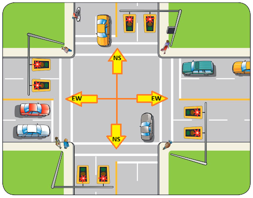
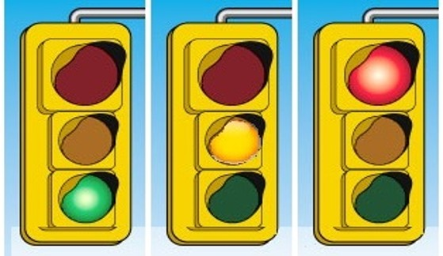

# APS145 - Applied Problem Solving

# Activity-8 (2.5%)

# Submission Instructions

At the start of class your professor will provide you with a worksheet for you to write your answers to the activity questions.

At the end of class, you must submit your worksheet(s) for grading (see the [grading rubric](./README.md#rubric) at the end of this page).

> [!CAUTION]
>
> **Worksheets will NOT be accepted after the end of class and no online submissions will be allowed**. 
> 
> This is an interactive class and **requires attendance** - if you are not present to actively work on the activity questions and participate in the discussions, you will not receive marks for the activity.

---

# Introduction

This activity will be focusing on two major concepts:

1. **[Timers - See course notes Appendix](https://seneca-scpa.github.io/Applied-Problem-Solving/Appendix/timer)**

    There are two primary approaches to applying Timers in programming logic. Review the course notes on timers for further explanation on these two approaches. In this activity, **you must apply the [ACCURATE](https://seneca-scpa.github.io/Applied-Problem-Solving/Appendix/timer#accurate-timer) method** where ever timers are required.
    
> [!IMPORTANT]
>  
> **Take a moment to review the course notes on this topic.**
>  

2. **Finite State Machines**

    A finite state machine is a programming model used to design systems that can be in only one of a limited number of states at any given time. The system transitions from one state to another based on inputs or events. Each state is discretely prescribed meaning, each state is predetermined based on a set of rules and predefined options (there is no sense of random behaviour).

This activity will explore how to implement proper timers and finite state logic in programming.

---

# [Computational Thinking](https://seneca-scpa.github.io/Applied-Problem-Solving/computational-thinking)

The below questions involve the application of:

* Understanding the problem
* Decomposition
* Data Representation
* Pattern Recognition
* Abstraction
* Algorithm
* Testing

---

# Problem #1

## Scenario

You need to develop an application to control a traffic light system that uses 3-lights with the intension of the lights operating endlessly however, as an exception, the logic should accommodate an interrupt (override) for situations where the lights need to be shutdown (ie: accidents, intersection construction etc..) which can occur at any moment in time and the lights must respond to such an interrupt immediately.

The sequence of the lights for a single direction is as follows:

1. **GREEN** (should be on for **50 seconds**)
2. **AMBER** (should be on for **5 seconds**)
3. **RED** (should be on for **55 seconds**)

However, there is a SAFETY protocol that mandates the entire intersection (each directional set of lights) must be in a RED light for 5 seconds to accommodate pedestrians who may still be crossing and/or cars stuck in the intersection making a left-turn. This RED light overlap time must be implemented. 

The application will execute based on an **assigned direction**. There are two possible directions:

1. Direction-1: East/West ("**EW**")
2. Direction-2: North/South ("**NS**")

The main function will receive an argument value (parameter name: `direction`) which will be either "EW" or "NS" representing the directional logic the lights should be implementing. 

This is important because one direction will be starting with a GREEN light, while the other direction will be starting with a RED light. Your logic however, should accommodate both possibilities even though only one of the two directions will be executed.

**NOTE**: All light durations must be managed applying the **accurate timer** technique.

> [!NOTE]
>  
> You do NOT have to manage this, but to make it clear how this application logic would be used, each direction will execute it's own instance of the application, so that means **TWO instances of the application** would be executed at the **same time**. Here is an example of how the application would be started for each direction:
>
>    * Direction-1: "trafficController.exe EW"
>    * Direction-2: "trafficController.exe NS"
>
> The arguments: `EW` or `NS` will denote how the application should commence (ex: what state it should start with) along with the sequence of states it must implement. It is therefore **VITAL** your logic **STATES** are **synchronized** with each directional logic!

 

---

### Your Task #1

Pair up with another student - or assemble into a group of four members. Half the group (either 1 or 2 person(s)) will be assigned to work on the Direction-1: East/West logic, and the other half (either 1 or 2 person(s)) will be responsible for Direction-2: North/South logic. 

This will help breakdown the work effort by half and it will help you collaborate to ensure your solutions will work together for an operating traffic light system without accidents (each directional STATE must be synchronized with the other direction)!

Decide amongst yourselves which member(s) will be working on Direction-1 or Direction-2. On your paper, write down the direction you are assigned and responsible for.

As a group, work out the following:

1. Identify the **STATES** needed for the traffic light system (hint: the light colours)

2. Based on the STATES you identified, map out the **SEQUENCE** of the states and what the OTHER directional STATE should be in at the same time. Here is a table template to use: 

    |SEQUENCE |DIRECTION-1 (EW) STATE | DURATION  | DIRECTION-2 (NS) STATE | DURATION  |
    |:---:    |:---                   | :---  | :---                   | :---  |
    |1        | STATE-NAME            | 00:00 | STATE-NAME             | 00:00 |
    |2        | STATE-NAME            | 00:00 | STATE-NAME             | 00:00 |
    
    **NOTE**: This is a template to work from. There are certainly more than 2 STATE's!

    For each state direction-1 is in, direction-2 must be in a corresponding complementary  state. What you want to look for is how the two directions will need to work together without causing an accident or conflict in flow. 
    
    At no time should both directions in the same sequence be allowing traffic through the intersection! Be sure to analyze the time durations for each state carefully and the effect it has on the other direction.
    
3. Using your table from step #2, extract and list only the data for Direction-1 (East/West) and reset the **SEQUENCE** to start at 1.

4. Using your table from step #2, extract and list only the data for Direction-2 (North/South) and reset the **SEQUENCE** to start at 1.

> [!CAUTION]
> **DO NOT PROCEED** to the next task until you have this part done correctly!
>
> **TEST** each of the sequences for each direction executing concurrently to ensure the states complement each other and are synchronized (ie: at no time should both directions be in a green or yellow state at the same time).
>
> 1. Test sequence #1 from Direction-1 complement's sequence #1 from Direction-2
> 2. Test sequence #2 from Direction-1 complement's sequence #2 from Direction-2
> 3. Test sequence #3 from Direction-1 complement's sequence #3 from Direction-2
>
> ... and so forth...

> [!IMPORTANT]
> Your professor will lead a discussion on your solutions and review potential answers. This is a good chance to evaluate with feedback on what makes a poor solution from a good solution. If you have questions, this is the time to ask and explore - **don't hold back!**
>

 

---

### Your Task #2

Before you can start working on your assigned parts, you will **all have to work together** to assemble a `main` function (flowchart). The same main function will be used by all members of the group since the logic will be the same. 

You have been used to the `main` function not having `parameters`, but in fact, main CAN receive arguments like any other function. These arguments are the command line arguments that are supplied when the application is executed. See the example "Note" above in the opening section for this problem. Therefore, the `main` function will have a `parameter` named **`direction`**.

The `main` function must refer to the `direction` argument variable to determine which directional state it's execution will be responsible for (ex: Direction-1 EW `OR` Direction-2 NS). It should only execute one of the two possible directions.

Remember, the traffic light controller application can only end if there is an interrupt. The application can also not execute if the start-up argument (`direction`) is not EW or NS. Keep in mind there is no screen/monitor for messages, so any important information like failure to start or ending because of an interrupt, should be LOGGED (written to a log file). You can simply state "Write to Log" along with the content you want to log in the file.

Again, all members will use the same main function flowchart since it will be common for all!

> [!IMPORTANT]
> Your professor will lead a discussion on your solutions and review potential answers. This is a good chance to evaluate with feedback on what makes a poor solution from a good solution. If you have questions, this is the time to ask and explore - **don't hold back!**
>

 

---

### Your Task #3

1. The remaining work will be developing the necessary pseudocode functions. Work on the traffic direction you have been assigned (if you are in a group of 4, then two students should work together). This will be either:

    * **Direction-1**: East/West logic **OR** 
    * **Direction-2**: North/South logic

> [!NOTE]
> After you complete this part (or when the time is up), proceed to question #2.
>

---

2. Regroup with your other member(s). Review each other's work/solutions.

    1. Can you identify anything in common?  List all the common parts (both logic and data).
    2. What are the only differences between Direction-1 and Direction-2 logic?
    3. Are there parts you should put into functions that could be shared and used by both directional logics to reduce redundancy? Could you use data STRUCTURES to help manage the data better and easier to maintain?
    4. **Refine your entire solution** to address any redundancies in logic and any other ways you can improve on it to work more efficiently.

 

> [!IMPORTANT]
> Your professor will lead a discussion on your solutions and review potential answers. This is a good chance to evaluate with feedback on what makes a poor solution from a good solution. If you have questions, this is the time to ask and explore - **don't hold back!**
>

 

---

# Rubric

## Grade Categories

| Grade | Description|
| ----- | -----------|
| **Unsatisfactory** | 1. Arrived in class more than 30 minutes after start of class `OR`   2. Did not attend `OR`   3. Did not participate (no participation)|
| **Incomplete** | 1. Arrived in class more than 10 minutes late (but less than 30 minutes) `OR`   2. Submitted work was incomplete/contains many errors `OR`  3. Partial participation|
| **Satisfactory** |1. Arrived in class within 10 minutes of start of class `AND`   2. Submitted work that is mostly completely without flaws `AND`   3. Exercised full participation|

## Grade Allocation

|  | Unsatisfactory | Incomplete | Satisfactory |
| -------- | ------- | ------- | ------- |
| **Grade** | `0.0` | `1.25` | `2.50` |