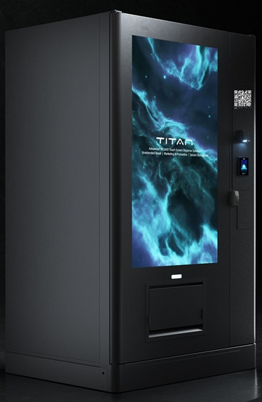

# APS145 - Applied Problem Solving

# Activity-9 (2.5%)

# Submission Instructions

At the start of class your professor will provide you with a worksheet for you to write your answers to the activity questions.

At the end of class, you must submit your worksheet(s) for grading (see the [grading rubric](./README.md#rubric) at the end of this page).

> [!CAUTION]
>
> **Worksheets will NOT be accepted after the end of class and no online submissions will be allowed**. 
> 
> This is an interactive class and **requires attendance** - if you are not present to actively work on the activity questions and participate in the discussions, you will not receive marks for the activity.

---

# Introduction

This activity will be focused on essential inventory management for an IoT (internet of things) vending machine. Inventory management is a complex and dynamic part of business systems and operations. There are many methods used to control and manage inventory efficiently based on many factors. 

We'll be looking at how a modern vending machine equipped with IoT is operated and managed. The type of inventory controls at work for this type of device and business model primarily involves the following:

- **Perpetual Inventory System**
    - Inventory is continuously being tracked unlike many other systems where inventory is counted periodically based on a planned schedule (less frequent).
    - Inventory is updated immediately as purchases are performed. 
    - Inventory updates are "pushed" in real-time (via internet/cloud) to the vending machine's operators/management systems.

- **Real-Time Monitoring**
    - Since inventory information is pushed in real-time to the vending machine's operators/management systems, inventory can be closely monitored to the second.
    - Real-time inventory data provides a tremendous efficiency in restocking vending machines that can be located over a vast area.
    - Data analytics can help predict (forecast) inventory changes based on historical trends etc., to provide a more proactive measure in maintaining inventory across many machines and their locations.
    - Route optimization is made possible and can be applied to efficiently plan a pre-determined route limited to only the machines requiring restocking of inventory.

Inventory is a big part of operating a vending machine, however, so too is the programming of the machine:

- How are orders made possible?
- How are the items located and made available to the customer?
- How are payments made? What options are there?
- How does inventory fit-in?

You will be exploring and discussing all of these things in this activity.

---

# [Computational Thinking](https://seneca-scpa.github.io/Applied-Problem-Solving/computational-thinking)

The below questions involve the application of:

* Understanding the problem
* Decomposition
* Data Representation
* Pattern Recognition
* Abstraction
* Algorithm
* Testing

---

# Problem

## Scenario

You need to program the logic for an IoT (Internet of Things) vending machine system which sells a wide range of products (various drinks and snacks). 

There are two parts to this system:
1. **Customer order** process and vending machine usage.
2. **Inventory management and monitoring** for all vending machines.

### Part-1: Customer Orders
The machine is equipped with a very large touch screen panel which uses a web service to manages the ordering process (essentially it's a webpage).

Customers are not limited to using the machine's touch screen panel as they can alternatively use their phone by scanning a unique QR code that is posted on the front of all vending machines which links their device to the same web service interface webpage.

QR codes support more information than a regular barcode and makes it possible to encode the URL to the ordering system as well as the unique vending machine identifier so the web service can reference the specific machine the customer is interacting with. 

This design provides a lot of flexibility and efficiencies since only one web application needs to be developed which can work for both the physical vending machine's touch screen panel and a customer's SMART phone.

> [!NOTE]
> The data is not stored on the machine itself, but in the cloud (web application), so all transactions (payments and inventory are reflected in real-time.

Payments are made using the machine's NFC (Near Field Communications) payment module for tap payments (credit card chips and respective equipped phone devices), or if the customer is using their phone, they can pay directly from their phone.

> [!TIP]
> 1. The web application will need to know if it is launched by the vending machine or a customer's device to be able to permit direct phone payment behavior.
>
> 2. If the order is done using the vending machine's touch panel, the customer must pay using the tap method.
>  

You need to define what the front-end UI design will be along with the essential supporting processes required to fulfill customer purchases.

There are **closed-box functions** available to help you streamline some of the details and should be applied where appropriate:

- `GetVendingIdentifier`:
    - Used to get the physical vending machine's unique identifier (not required for mobile orders since this information is in the QR Code!)
    - **PARAMS**: NOTHING
    - **RETURNS**: Vending machine identifier

- `GetVendingMachineInventory`:
    - Used to obtain all the inventory data for a specific machine
    - **PARAMS**: A vending machine's unique identifier
    - **RETURNS**: A collection of product information

- `UpdateVendingMachineInventory`:
    - Used to apply changes to the inventory after an order is successfully placed.
    - **PARAMS**: 
        - A vending machine's unique identifier
        - A product information structure reflecting the update
    - **RETURNS**: NOTHING

- `MakePayment`:
    - Used to make payments.
    - **PARAMS**: 
        - A vending machine's unique identifier
        - Amount to be paid
    - **RETURNS**: a **POSITIVE** transaction number (if successful) or **NEGATIVE** number (if payment failed)

- `DispenseItem`:
    - Used to physically dispense a product from a specific slot position.
    - **PARAMS**: 
        - A vending machine's unique identifier
        - Slot position
        - Quantity to dispense
    - **RETURNS**: NOTHING

- `SubmitOrder`:
    - Used to record an order that has been successfully placed.
    - **PARAMS**:
        - A vending machine's unique identifier
        - An order information structure reflecting a completed order (paid)
    - **RETURNS**: NOTHING

---

#### **Task-1**:

Assemble into a team of 2 or 3 students. It is time for you to build upon your collaboration and communication skills to learn how to effectively and efficiently work in teams. NOTE: You must still maintain your own answers for your hand-in.

To manage inventory, there is more information to be tracked than simply the product and how many (quantity) there is available. There needs to be a threshold value set to indicate when a product is due for more inventory before it is actually depleted to avoid unavailable products. Each product will need to have its own threshold setting (commonly referred to as "MinimumQuantity") to help identify products needing more inventory.

> [!TIP]
> Your professor will discuss this using a GENERAL scenario of how this is applied to manage inventory levels. The solution to how you implement or represent this in your data will not be initially given to you!
>

Identify the important data and create the necessary data structures to best represent this information in a way it will be easy to use in the solution. Here are some hints to think about:

- What exactly is a **Vending Machine**, how should this be represented?
- What exactly is a **Product**, how should this be represented?
- What exactly is **Inventory**, how should this be represented?
- What exactly is an **Order**, how should this be represented?

 

> [!IMPORTANT]
> Your professor will lead a discussion on your solutions and review potential answers. This is a good chance to evaluate with feedback on what makes a poor solution from a good solution. If you have questions, this is the time to ask and explore - **don't hold back!**
>

---

#### **Task-2**:

Technically the vending machine should run forever but can be stopped if there is an INTERRUPT in which case the application and machine will be powered down. You may assume an interrupt will not occur if the machine is actively being used by a customer. With this in mind, breakdown the problem into the necessary **major tasks** to help simplify how you will solve the problem.

Here are some things to think about:
- When the machine is doing nothing, what should happen on the large screen?
- Approach this from a customer's perspective, what are the typical sequence of steps you go through to purchase an item?
- Review the constraints of the problem. Should you show products that have run out of inventory? Can you fulfill a request for more quantity than there is available?

 

> [!IMPORTANT]
> Your professor will lead a discussion on your solutions and review potential answers. This is a good chance to evaluate with feedback on what makes a poor solution from a good solution. If you have questions, this is the time to ask and explore - **don't hold back!**
>

---

#### **Task-3**:
Design the `main` **flowchart** function for the customer order logic. Remember the purpose of the main function is to remain simple and does not go into great detail, but it does represent the lifespan of the application from start to end.

 

> [!IMPORTANT]
> Your professor will lead a discussion on your solutions and review potential answers. This is a good chance to evaluate with feedback on what makes a poor solution from a good solution. If you have questions, this is the time to ask and explore - **don't hold back!**
>

---

#### **Task-4**:
Design the supporting pseudocode functions needed to complete the solution. Reflect back on Task-2 to help you build out this logic. 

Use your team members effectively and consider having each member work on specific parts, but continue  communicating with each other to make sure your efforts successfully work together and don't overlap or cause duplication.

> [!IMPORTANT]
> Your professor will lead a discussion on your solutions and review potential answers. This is a good chance to evaluate with feedback on what makes a poor solution from a good solution. If you have questions, this is the time to ask and explore - **don't hold back!**
>

---

### Part-2: Inventory Management and Monitoring

**Time Permitting / Homework for extra practice**

The vending management team will also require an application to help them monitor all the vending machines and their respective inventories. They will need the ability to identify which machines and products have run out or will soon run out (based on product thresholds, historical data and forecasting etc.). 

The application must prioritize a listing of machines where inventory is low or critical. The application data should be updated (refreshed) frequently but not in actual real-time (ie: milliseconds) as this would be putting too much demand on the system, so the data update frequency should be performed every 10 seconds, therefore a timer will be required to manage this.

The application should colour-code the background text of inventory items based on their state:

* RED: Any vending machine products that have completely run out of inventory.
* AMBER: Any vending machine products that have met their minimum quantity thresholds.
* GREEN: Any vending machine products that are within 5% of their minimum quantity thresholds.

The operator should be able to target a specific vending machine and post an interrupt to shut it down if needed.

> [!NOTE]
> Orders and sales information (revenue) is not part of the scope for this application. This application is focussed only one inventory management.
>

There are **closed-box functions** available to help you streamline some of the details and should be applied where appropriate:

- `GetAllInventory`:
    - This is used to get all the data for every vending machine.
    - **PARAMS**: A collection of vending machine information (includes inventory). This information is implicitly returned.
    - **RETURNS**: NOTHING

- `SendVendingMachineInterrupt`:
    - This is used to shutdown a vending machine (it will not interrupt an active customer order)
    - **PARAMS**: A vending machine's unique identifier
    - **RETURNS**: NOTHING

---

#### **Task-1**:

Identify the data needed for this application. Review the data structures used in the customer order application and apply the similarities but modify as needed.

---

#### **Task-2**:

Identify the major tasks this application will need to implement. Break it down into reasonable pieces of work.

---

#### **Task-3**:

Create the main flowchart function that will drive the application from start to end. 

---

#### **Task-4**:

Create the supporting pseudocode functions detailing the remaining logic required to complete the application.

 

---

# Rubric

## Grade Categories

| Grade | Description|
| ----- | -----------|
| **Unsatisfactory** | 1. Arrived in class more than 30 minutes after start of class `OR`   2. Did not attend `OR`   3. Did not participate (no participation)|
| **Incomplete** | 1. Arrived in class more than 10 minutes late (but less than 30 minutes) `OR`   2. Submitted work was incomplete/contains many errors `OR`  3. Partial participation|
| **Satisfactory** |1. Arrived in class within 10 minutes of start of class `AND`   2. Submitted work that is mostly completely without flaws `AND`   3. Exercised full participation|

## Grade Allocation

|  | Unsatisfactory | Incomplete | Satisfactory |
| -------- | ------- | ------- | ------- |
| **Grade** | `0.0` | `1.25` | `2.50` |