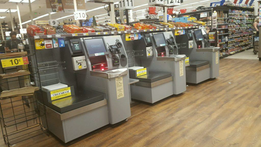
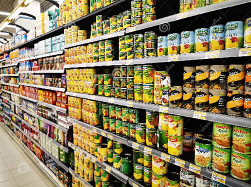
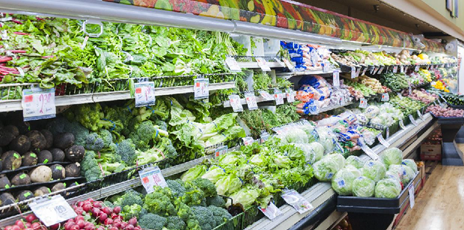
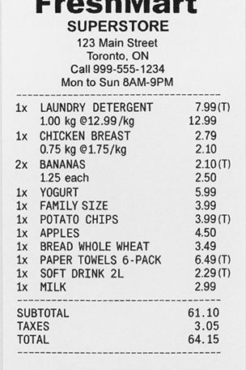

# APS145 - Applied Problem Solving

# Activity-10 (2.5%)

# Submission Instructions

At the start of class your professor will provide you with a worksheet for you to write your answers to the activity questions.

At the end of class, you must submit your worksheet(s) for grading (see the [grading rubric](./README.md#rubric) at the end of this page).

> [!CAUTION]
>
> **Worksheets will NOT be accepted after the end of class and no online submissions will be allowed**. 
> 
> This is an interactive class and **requires attendance** - if you are not present to actively work on the activity questions and participate in the discussions, you will not receive marks for the activity.

---

# Introduction

POS (Point of Sales) systems dates back to 1879 which was when the first cash register "device" was invented! POS systems have evolved a number of times leading to what they are today and have changed primarily because of advances in technology but also due to associated costs that come with human operations.

One such system emerging in the the late 1990's but booming in the early 2000's was the "self-checkout" machines placed in major grocery and building centers. These machines remain today and are still heavily represented in these types of stores. Today's activity is going to be about these self-checkout POS systems and looking at how you would program the logic for processing perishable and non-perishable grocery store items for a customer.

---

# [Computational Thinking](https://seneca-scpa.github.io/Applied-Problem-Solving/computational-thinking)

The below questions involve the application of:

* Understanding the problem
* Decomposition
* Data Representation
* Pattern Recognition
* Abstraction
* Algorithm
* Testing

---

# Problem

(Source Image: [link](https://sintelsystems.com/wp/wp-content/uploads/2018/08/self-checkout-kiosk-Ralphs-1024x576.jpg) )

You need to create the programming logic needed to run a **self-checkout POS (Point of Sale System)** for a local grocery store. These systems are capable of processing **non-perishable** products which are those that can be scanned, and **perishable** products which are those which must be looked-up (searched) and then either weighed, or a unit quantity be entered.

(Source Image: [link](https://thumbs.dreamstime.com/z/doha-qatar-march-supermarkets-full-grocery-items-corona-virus-spread-epidemic-176550451.jpg))

The customer must perform the manual parts of this process which include waving non-perishable products under a scanner for the product barcode to be read. A barcode is typically a 12-digit number providing the necessary data to identify a **Universal Product Code (UPC)** which can be used to perform a product lookup against the store's inventory to get all the product information.

(Source Image: [link](https://s.yimg.com/uu/api/res/1.2/AP.bZIUJfFFo5zLYQ9x8rA--~B/aD0yODMyO3c9NDI1NjtzbT0xO2FwcGlkPXl0YWNoeW9u/http://media.zenfs.com/en-US/homerun/money_403/f6ed613c196b75ab1942afb470f1c408))

Perishable products do not have a scannable barcode and must be processed differently. Stickers are placed on these products consisting of a 4-5 digit number which must be manually entered by the customer to perform a product lookup. This numbered code is called a **Product Lookup Code (PLU)** which is set and managed by the store for the purposes of being able to quickly perform product lookup's to get product details. Before you can proceed to process a perishable product, you must first determine if the product is priced based on it's weight (ex: bananas and apples) or by the unit quantity (ex: peppers and cucumbers), so identifying and getting the product details first is required.

(Source Image: Copilot Gen-AI )

Not every product is taxable, but generally, perishable products are not taxed and non-perishable are usually taxed but this is not a rule and there are always exceptions. Therefore, we must design the system to work for any product that is supposed to be taxed. When providing a view of the order details (and receipt), each taxable item should be identified with a "`(T)`" beside the item price to make it easy to identify all the taxable items.

Customers scan process their shopping items in any sequence/order they wish so the system must be able to accommodate this flexibility however, the system must maintain the same order in which the customer processes each item (ex: the receipt will show the items in the same order they were processed by the customer).

The POS machine's touch screen will need to be used effectively to make it easy for customers to use. The following are some key aspects that should minimally be addressed:

- Simple concise directions
- Controls/Buttons for the necessary actions
- View of the order details including each item and sub-totals, taxes (13%), and total.

The system is not fool-proof and can experience problems which require assistance from a grocery store employee who oversees the self-checkout area. The logic for this system must take into account failures in reading a barcode or performing product lookups which result in no product details being available. Notification should be provided to the customer to get help from the assistant to resolve these situations.

---

## Closed-Box Functions

There are a number of **closed-box functions** available to help you streamline some of the details and should be applied where appropriate:

- `ProductLookup(12-digit UPC |or| a 4-5 digit PLU code)`
    - Used to get the details of a product
    - **PARAMS**: Either a 12-digit UPC code number OR a 4-5 digit PLU code number
    - **RETURN**: product detail or EMPTY if the product is not found in the store inventory

- `GenerateReceiptNumber()`
    - Used to create a new receipt number (a unique receipt identifier for each order)
    - **PARAMS**: NONE
    - **RETURN**: number identifying a unique receipt number for an order

- `MakePayment (amount, receipt number)`
    - Used to make payments (payment type etc. is all handled within this closed box)
    - **PARAMS-1**: amount (to be charged)
    - **PARAMS-2**: receipt number
    - **RETURN**: number identifying a unique reference number for a payment

- `WeighItem()`
    - Used to obtain a weigh-scale value of a product
    - **PARAMS**: NONE
    - **RETURN**: real number (with decimal point)

- `GetHelp()`
    - Used to represent the customer receiving help from a store assistant. **Note: it is assumed the problem will be resolved.**
    - **PARAMS**: NONE
    - **RETURN**: NONE

- `GenerateReceipt(order details)`
    - Used to print a physical receipt for the customer to take after making a successful payment
    - **PARAMS**: order details (data representing what would be needed on a receipt)
    - **RETURN**: NONE

---

## **Task-1**

Assemble into a team of 2 or 3 students. It is time for you to build upon your collaboration and communication skills to learn how to effectively and efficiently work in teams. NOTE: You must still maintain your own answers for your hand-in.

Identify the important data and create the necessary data structures to best represent this information in a way it will be easy to use in the solution.

 

> [!IMPORTANT]
> Your professor will lead a discussion on your solutions and review potential answers. This is a good chance to evaluate with feedback on what makes a poor solution from a good solution. If you have questions, this is the time to ask and explore - **don't hold back!**
>

---

## **Task-2**

Technically the POS machine should run forever but can be stopped if there is an INTERRUPT in which case the application and machine will be powered down. You may assume an interrupt will not occur if the machine is actively being used by a customer. With this in mind, breakdown the problem into the necessary **major tasks** (high probability of being functions) to help simplify how you will solve the problem.

 

> [!IMPORTANT]
> Your professor will lead a discussion on your solutions and review potential answers. This is a good chance to evaluate with feedback on what makes a poor solution from a good solution. If you have questions, this is the time to ask and explore - **don't hold back!**
>

---

## **Task-3**

Design the `main` **flowchart** function for the POS system logic. Remember the purpose of the main function is to remain simple and does not go into great detail, but it does represent the lifespan of the application from start to end.

 

> [!IMPORTANT]
> Your professor will lead a discussion on your solutions and review potential answers. This is a good chance to evaluate with feedback on what makes a poor solution from a good solution. If you have questions, this is the time to ask and explore - **don't hold back!**
>

---

## **Task-4**

Design the supporting pseudocode functions needed to complete the solution. Reflect back on Task-2 to help you build out this logic. 

Use your team members effectively and consider having each member work on specific parts, but continue communicating with each other to make sure your efforts successfully work together and don't overlap or cause duplication.

> [!IMPORTANT]
> Your professor will lead a discussion on your solutions and review potential answers. This is a good chance to evaluate with feedback on what makes a poor solution from a good solution. If you have questions, this is the time to ask and explore - **don't hold back!**
>

---

# Rubric

## Grade Categories

| Grade | Description|
| ----- | -----------|
| **Unsatisfactory** | 1. Arrived in class more than 30 minutes after start of class `OR`   2. Did not attend `OR`   3. Did not participate (no participation)|
| **Incomplete** | 1. Arrived in class more than 10 minutes late (but less than 30 minutes) `OR`   2. Submitted work was incomplete/contains many errors `OR`  3. Partial participation|
| **Satisfactory** |1. Arrived in class within 10 minutes of start of class `AND`   2. Submitted work that is mostly completely without flaws `AND`   3. Exercised full participation|

## Grade Allocation

|  | Unsatisfactory | Incomplete | Satisfactory |
| -------- | ------- | ------- | ------- |
| **Grade** | `0.0` | `1.25` | `2.50` |